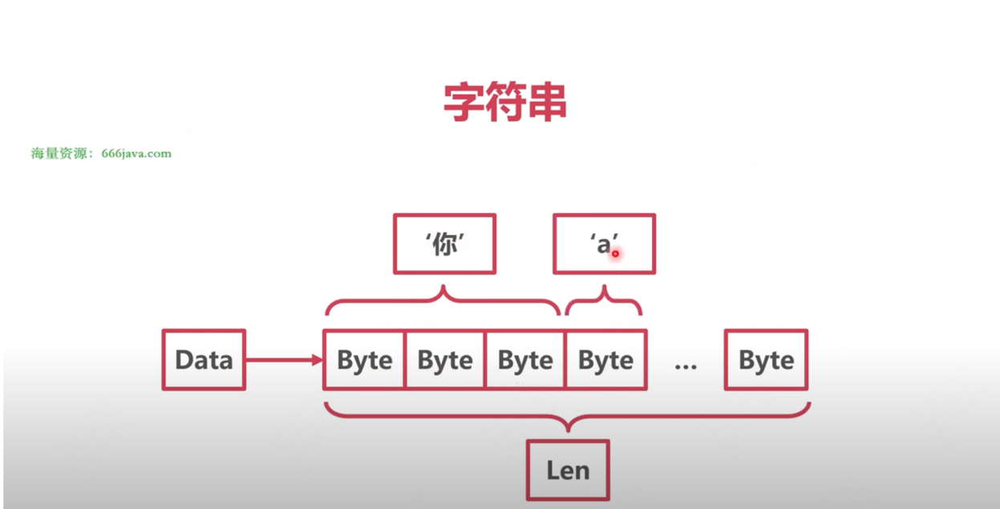
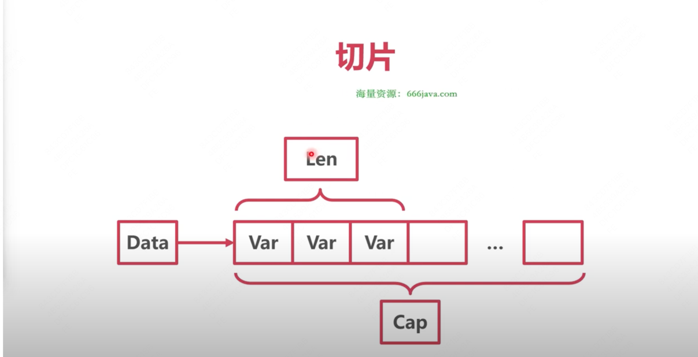
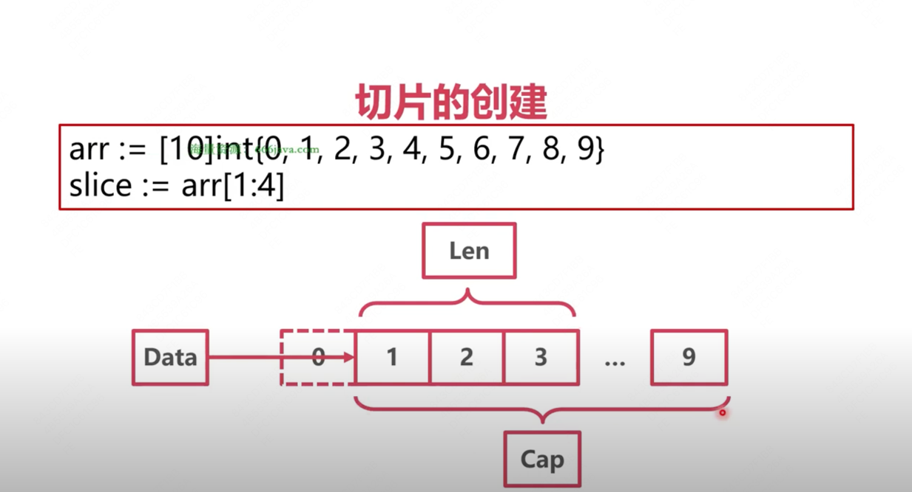
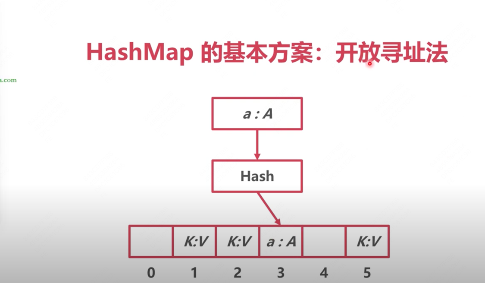
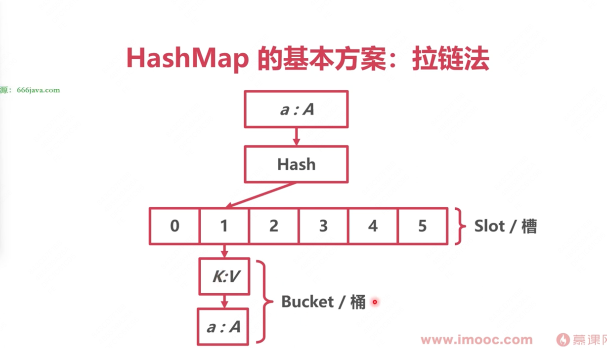
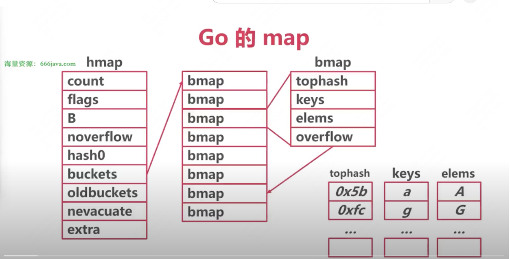

# 第四章 高并发下的数据结构
* Go常见类型的底层原理
* 字符串、切片、map
* 接口、结构体


## 4.1什么变量的的大小是0字节？
* int大小跟随系统字长
* 指针的大小也是系统字长

### 空结构体
1. 空结构体的地址均相同（不被包含在其他结构体中时）zerobase
2. 空结构体主要是为了节约内存
* 结合map，只想要键，不想要值
* 结合channel，只想发一个信号，不想携带任何信息的话


### 总结
1. Go中部分数据结构的长度与系统字长有关
2. 空结构体不占用空间
3. 空结构体与map结合可以实现hashset
4. 空结构体与channel结合可以当作纯信号

# 4.2 数组，字符串，切片底层是一样的吗？
## 字符串
```
//小写的结构体，不允许外部直接使用，可以使用StringHeader
type stringStruct struct {
	str unsafe.Pointer
	len int
} 

type StringHeader struct {
	Data uintptr
	Len  int
}
```
1. 字符串本质是个结构体
2. Data指针指向底层Byte数组
3. Len表示Byte数组长度（字节数）
4. 


## 字符串编码问题
1. 所有的字符串均使用Unicode字符集
2. 使用UTF-8编码

### Unicode
1. 一种统一的字符集
2. 囊括了159种文字的144679个字符
3. 14万个字符只少需要3个字节表示
4. 英文字母均排在前128个

### UTF-8
1. Unicode的一种变长格式
2. 128个US-ASCII字符只需要1个字节编码
3. 西方常用字符需要2个字节
4. 其他字符需要3个字节，及少需要4个字节

## 字符串访问
1. 对字符串使用len方法得到的是字节数而不是字符数
2. 对字符串直接使用下标访问，得到的是字节
3. 字符串被range遍历时，被解码成rune（uft8）类型的字符
4. UTF-8编码解码算法位于runtime/utf8.go

## 字符串的切分
1. 需要切分时：
* 转为rune数组
* 切片
* 转为string
* s = string([]rune(s)[:3])

# 4.3 数组，字符串，切片底层是一样的吗？二

## 切片
1. 每个字符串长度都是16、每个切片长度都是24
2. 切片的本质是对数组的引用
```
type slice struct {
	array unsafe.Pointer
	len   int
	cap   int
}
```
3. 切片底层示意图：

## 切片的创建
1. 根据数组创建
```
arr[0:3] or slice[0:3]
```
2. 字面量：编译时插入创建数组的代码
```
slice := []int{1, 2, 3}
```
3. make：运行时创建数组
```
slice := make([]int, 10)
```

4. 切片创建示意图 

## 切片访问
1. 下标直接访问
2. range遍历元素
3. len（slice）查看切片长度
4. cap（slice）查看数组容量

## 切片的追加-slice.go
1. 不扩容时，只调整len（编译器负责），
2. 扩容时，编译器转为调用runtime.growslice()
3. 如果期望容量大于当前容量的2倍就会使用期望容量
4. 如果当前切片长度小于1024，将容量翻倍
5. 如果当前切片长度大于1024，每次增加25%
6. 切片扩容时，并发不安全，注意切片并发要加锁

## 总结
1. 字符串与切片都是对底层数组的引用
2. 字符串有UTF-8变长编码的特点
3. 切片的容量和长度不同
4. 切片追加时可能需要重建底层数组

# 4.4 map：重写Redis能用它吗？一
## HashMap的基本方案
1. 开放寻址法

2. 拉链法


## Go的map
1. runtime.hmap
```
// A header for a Go map.
type hmap struct {
	// Note: the format of the hmap is also encoded in cmd/compile/internal/reflectdata/reflect.go.
	// Make sure this stays in sync with the compiler's definition.
	count     int // # live cells == size of map.  Must be first (used by len() builtin)
	flags     uint8
	B         uint8  // log_2 of # of buckets (can hold up to loadFactor * 2^B items)
	noverflow uint16 // approximate number of overflow buckets; see incrnoverflow for details
	hash0     uint32 // hash seed

	buckets    unsafe.Pointer // array of 2^B Buckets. may be nil if count==0.
	oldbuckets unsafe.Pointer // previous bucket array of half the size, non-nil only when growing
	nevacuate  uintptr        // progress counter for evacuation (buckets less than this have been evacuated)

	extra *mapextra // optional fields
}
```

